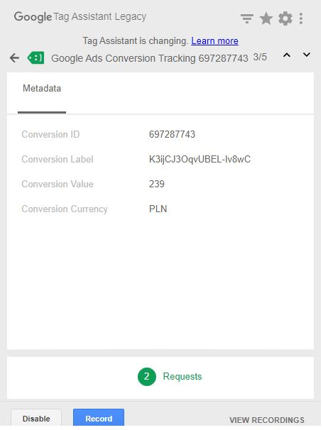

# WooCommerce Google Ads Purchase Tracking with gtag.js

Use file manager for implementation

```
- wp-content > themes > YOUT_TEMPLATE > functions.php
```

Use wp-admin

```
- Appearances > Thema Editor > functions.php
```

Do not forget to replace

```
- AW_MEASUREMENT_ID
- AW-CONVERSION_ID
- AW-CONVERSION_LABEL
```

Built With

```
[php]
```

Authors

**Gultkein Cirik** - [gu1tekin](https://github.com/gu1tekin)

## Screenshots from Tag Assistant Legacy:


